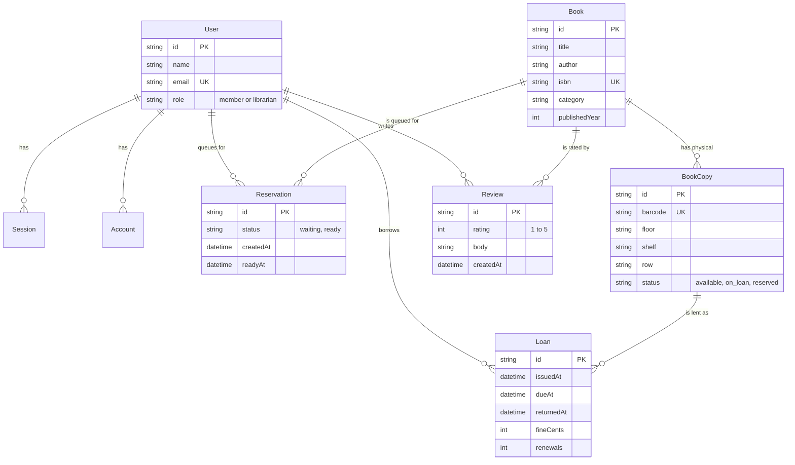

# BookStack

A library book management system for tracking a physical collection: cataloguing books and their individual copies, issuing and returning them, calculating overdue fines, and managing a fair reservation queue when every copy is out.

Built as a college major project.

## What makes it more than a CRUD app

- **Borrowing happens on the site.** Members borrow, renew and return themselves; the librarian desk exists as an override, not as the only path.
- **Recommendations from real behaviour.** Collaborative filtering over the loans table powers "members who borrowed this also borrowed" and a personalised dashboard feed, rather than matching on category.
- **Shelf-level location tracking.** Every physical copy records Floor, Shelf and Row, so a member searching the catalogue is told exactly where to walk. Most basic library systems stop at "available: yes/no".
- **A fair reservation queue.** When all copies are out, members join a queue. The moment a copy is returned it is placed on hold for the person at the front rather than going back on the shelf.
- **Automatic overdue fines.** Fines accrue per day past the due date, shown live to the member while the book is still out and recorded permanently on return.
- **Role-aware interface.** The same routes render differently for members and librarians, and librarian-only pages are protected at the data layer, not just hidden in the navigation.

## Tech stack

| Layer | Choice |
| --- | --- |
| Framework | Next.js 16.3 (App Router, React 19, Server Actions) |
| Language | TypeScript |
| Styling | Tailwind CSS v4 |
| Database | Neon Postgres |
| ORM | Prisma 7 with the Neon driver adapter |
| Auth | Better Auth (email/password + Google OAuth) |

## Features

**Members**
- Search the catalogue by title, author, ISBN, category or description
- Filter by category and by "on shelf only"
- **Borrow a book directly from its page** — the loan is created online, no desk visit
- **Return and renew from the dashboard**, with renewals blocked when someone is queued
- Reserve a book when no copies are free, and see queue position
- Rate and review books they have borrowed, with a verified-borrower badge
- Personalised recommendations from collaborative filtering over borrowing history
- Dashboard with current loans, days remaining, overdue warnings, running fine, and full borrowing history

**Librarians** (everything above, plus)
- Add, edit and delete books
- Add and remove individual copies, with auto-generated barcodes
- Issue or return any copy on a member's behalf at the circulation desk, including webcam barcode scanning
- Analytics: most-borrowed titles, category demand, monthly trend, late-return rate, and which titles to buy more copies of
- Library-wide statistics and a list of everything currently on loan
- Promote members to librarian

## Data model



The key modelling decision is the split between `Book` (the title, its ISBN and metadata) and `BookCopy` (a physical object on a shelf with its own barcode and location). Loans attach to a copy, reservations attach to a title — which is what lets the queue work correctly when a library owns several copies of the same book.

## Business rules

| Rule | Value | Where |
| --- | --- | --- |
| Loan period | 14 days | `LOAN_DAYS` in `lib/library.ts` |
| Fine rate | Rs 5.00 per day overdue | `FINE_PER_DAY_PAISE` |
| Borrowing limit | 3 books at once | `MAX_ACTIVE_LOANS` |
| Renewal limit | 2 renewals per loan | `MAX_RENEWALS` |
| Borrowing blocked at | Rs 50.00 of unpaid fines | `FINE_BORROW_BLOCK_PAISE` |

Other enforced rules: a copy already on loan cannot be issued again; a copy held for the queue can only be issued to the member it is held for; a book with copies still on loan cannot be deleted; a copy on loan cannot be removed; ISBNs are unique; and new sign-ups are always created as `member` regardless of what the request body contains.

## Getting started

```bash
pnpm install
```

Create `.env.local` from the template:

```bash
cp .env.example .env.local
```

Fill in the values:

| Variable | Purpose |
| --- | --- |
| `DATABASE_URL` | Neon pooled connection string, used by the app |
| `DATABASE_URL_UNPOOLED` | Neon direct connection, used by migrations |
| `BETTER_AUTH_SECRET` | Signs session cookies |
| `BETTER_AUTH_URL` | Base URL, e.g. `http://localhost:3000` |
| `GOOGLE_CLIENT_ID` | Optional; Google sign-in is hidden until set |
| `GOOGLE_CLIENT_SECRET` | Optional |

Generate a secret with:

```bash
node -e "console.log(require('crypto').randomBytes(32).toString('base64url'))"
```

Apply the schema and load sample data:

```bash
pnpm db:migrate
```

```bash
pnpm db:seed
```

Start the app:

```bash
pnpm dev
```

The seed loads 24 real books across 10 categories with 85 physical copies spread over three floors.

To give the recommendations and analytics something to work with, load sample borrowing history:

```bash
npx tsx prisma/seed-demo.ts
```

That creates 30 members with persona-driven reading patterns, roughly 145 loans and 75 reviews.

## Scripts

| Command | Does |
| --- | --- |
| `pnpm dev` | Development server |
| `pnpm build` | Production build |
| `pnpm db:migrate` | Create and apply a migration |
| `pnpm db:deploy` | Apply existing migrations (production) |
| `pnpm db:seed` | Load the sample catalogue |
| `pnpm db:studio` | Browse the database in Prisma Studio |

## Making yourself a librarian

The first account you create is a `member`. Promote it once, directly in the database:

```bash
pnpm db:studio
```

Open the `users` table and change `role` to `librarian`. After that you can promote anyone else from the Members page in the app.

## Demo walkthrough

A five-minute route through the project that shows every subsystem.

1. **Sign up** at `/sign-up`. Point out that the account is created as a member even though the client could send any role — the server ignores it.
2. **Search the catalogue.** Type `Kleppmann` for author search, then `9780441013593` for ISBN search, then filter by the Thriller category.
3. **Borrow a book.** Open any title with copies on the shelf and press Borrow. The loan is created there and then, the copy flips to on loan, and the response names the shelf to collect it from.
4. **Show the dashboard.** The new loan appears with days remaining, Return and Renew buttons, and a renewal counter.
5. **Renew it**, then try renewing a book somebody else is queued for — that one is refused.
6. **Demonstrate a fine.** Set a loan's `dueAt` to a past date in Prisma Studio, reload, and the overdue badge and running fine appear. Return it and the fine lands in the history table.
7. **Demonstrate the queue.** Borrow every copy of a two-copy book, then reserve it from another account. Return one copy: it is held rather than reshelved, and the waiting member is told a copy is ready.
8. **Show the recommendations.** "Members who borrowed this also borrowed" is collaborative filtering over real loan history, not a category lookup. The dashboard's "Picked for you" does the same per member.
9. **Open Analytics** (librarian): monthly trend, most-borrowed titles, category demand, late-return rate, and a purchase-suggestion list ranked by loans per copy.
10. **Add a book**, and scan a barcode at the Circulation desk with the webcam.

## Project structure

```
app/
  (auth)/          sign-in and sign-up
  api/auth/        Better Auth route handler
  catalogue/       search, book detail, add, edit
  circulation/     issue and return desk
  dashboard/       member and librarian home
  members/         member list and role management
components/        UI components, all icons as inline SVG
lib/
  auth.ts          Better Auth server config
  actions.ts       circulation server actions
  book-actions.ts  catalogue CRUD server actions
  library.ts       queries and business rules
  session.ts       requireUser / requireLibrarian guards
prisma/
  schema.prisma    data model
  seed.ts          sample catalogue
proxy.ts           route guard (Next.js 16 renamed middleware to proxy)
```

## Security notes

- Route protection is layered. `proxy.ts` does a fast cookie check to redirect signed-out visitors, but the real authorisation happens in `lib/session.ts` next to the database, so a forged cookie gains nothing.
- `requireLibrarian()` runs inside every librarian-only server action, not just on the page — hiding a button is not access control.
- The `role` field is declared with `input: false`, so it cannot be set through the sign-up API.
- `?redirectTo=` is validated to same-origin paths to prevent open redirects.
